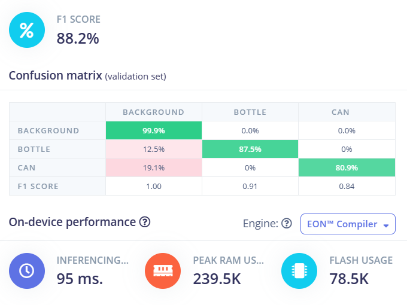
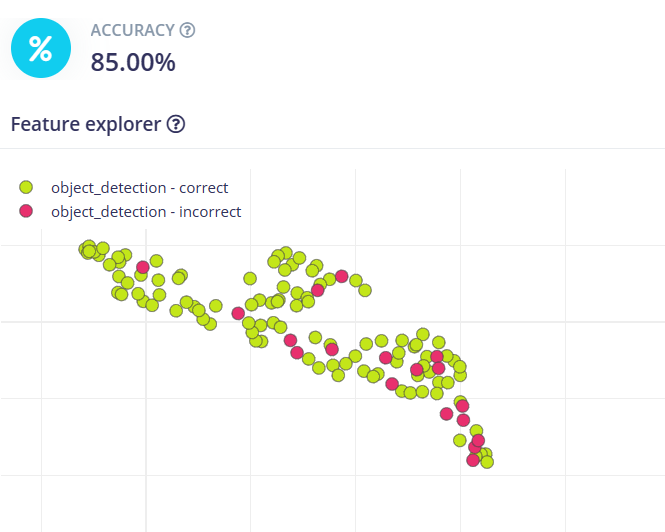

# Edge-AI-Trash-detection-and-classification

## Description
We took garbage dataset of 2 classes (Bottles and Cans) from Kaggle for the training of FOMO (Faster Objects, More Objects) MobileNetV2 0.35 model, used for object detection, and deployed it on Arduino Nicla Vision. Our hardware is able to detect the plastic bottles and metal cans and is able to classify them. We used Edge impulse for the training purpose as it is very straight forward and does not require any coding, also it gives the tflite model which can be directly deployed on the edge devices. Arduino Nicla vision (Cortex-M7 480 MHz) is used because of its small size which can be deployed anywhere.

## Installation
### Directly using the model
Download the FOMO int8 tflite model from repo and open it in OpenMV and flash it in your hardware and test the working of the model.

### Reproducing the model with different parameters and dataset
1. Dataset zip file is available in the repository, which can be downloaded.
3. Open Edge impulse and sign in into it.
4. Change the labelling method to bounding boxes.
5. Select the target device, in our case, Arduino Nicla Vision (Cortex-M7 480 MHz).
6. If you want to collect data from your own hardware go to Devices and collect the data, we had data from the kaggle dataset which we uploaded and labelled.
7. Go to data acquisition and upload the training data and testing data from the Data zip file in repo. Labelling is not required as it is already labelled so it will use the labels info from the file itself. If you want to add different data with different dataset with different number of classes, you can do that and do the manual labelling.
8. Go to Create Impulse, select the image size as 96 x 96 and select the Resize mode to 'Fit longest axis', add processing block and learning block and save impulse.
9. In the image section save parameters as RGB and save, then select generate features and features will be generated in few minutes.
10. Go to object detection and select parameters, training cycle: 80, Learning rate: 0.001, Data augmentation: yes, Profile int8 model: yes, validation size: 20%, select model as FOMO (Faster Objects, More Objects) MobileNetV2 0.35 and then start training. You can change the parameters according to your needs.
11. Training will take 15-20 minutes and it will give a confusion matrix with F1 score.
12. Go to model testing and classify the test data, which will give the accuracy of the model, we got 85% accuracy for our model.
13. Go to deployment and choose OpenMV as deployment option and click on 'build' which will download your tflite model which can be deployed on your device using OpenMV.
14. Open your tflite model on the OpenMV and flash your hardware and test the working of your model.

## Results of the project
       
Confusion Matrix of FOMO int8 model       

     
Accuracy of the FOMO int8 model on the test dataset (20%)       

## Working of the Project
Youtube: https://youtu.be/8U-2VrPENp8?si=sKW4kywQF0OKIItJ

## Credits
[Md Farhad Hussain](https://github.com/mfarhadhussain),
[Dinesh T](https://github.com/dinesh-tamilselvan)
